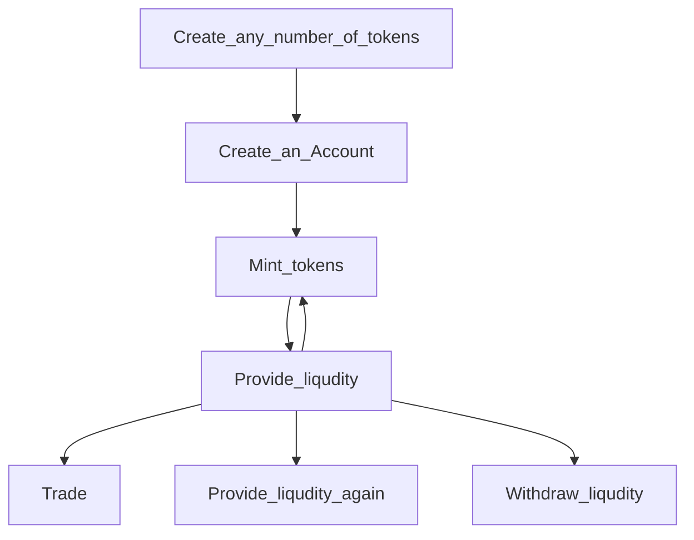

# CSE201-project


C++ project on building a liquidity protocol and a market simulator to test the different automated market makers in different scenarios.
The goal is to build an environment where we can test the already existing algorithms and implement our own AMM algorithm.


## Members
| name | github username | trello username | role |
|:------------:|:---------------:|:---------------:|:------:|
| Adithya Ravichandran | Ad1thya-R | ad1thya_r | Responsible for Git |
| Levente Ludányi | ludlev2 | leventeludanyi | Project Leader |
| Fryderyk Sitnik | fryderyk-sitnik | fryderyksitnik2 | Responsible for Trello |
| Shubh Lashkery | shubhlashkery | shubhlashkery | Economics Team Leader |
| Martina Paez Berru  | Martina-Paez-Berru | martinapaezberru | Frontend Team Leader |
| Kaoutar Fahraoui | Kaoutar-Fahraoui | kaoutar.fahraoui |  |
| Mia Chambat | miachambat | miachambat |  |
| Amine Roudani | amineroudani | amineroudani |  |
| Julien Girod | juliengirod | Julien Girod |  |
| Duc Nguyen | combi2k2 | Duc Nguyen | Protocols Team Leader |
| Victoire Fabien | victoire-fabien | victoire-fabien |  |
| Jasmine Samson | Jasmine-Samson | jasmine samson |  |
| Minh Pham | minhpham160603 | minhpham1606 |  |
| Tu Nguyen | ngoctu-nguyen | nguyenngoctu03 |  |
| The Nguyen | the-nguyen | thenguyen33 |  |
| Alessandro Massaad | alemassaad | alemassaad |  |
| Mathéo Le Masson | Matheo-LeMasson | matheo-lemasson |  |
| Gabriele Biroli | GabrieleBiroli | gabrielebiroli |  |


## Teams
The teams are more of a guidline, the tasks are not limited to what the team names would indicate
### Economics
- Shubh
- Gabriele
- Kaoutar
- Mia

### Protocol
- Amine
- Julien
- Duc

### Frontend
- Jasmine
- Victoire
- Martina

### Playground
- Minh
- The
- Levente
- Adithya
- Fryderyk
- Tu
- Alessandro
- Matheo

## Building guide

clone the repository
- Enter the intended location
- Run
```
git clone https://github.com/Liquidity-protocol-CSE201-Project/Project
```

Download [Qt Creator](https://www.qt.io/product/development-tools) then open the project in Qt Creator to run it.
- Open Qt Creator
- Click on `File`
- Click on `Open File or Project...`
- Follow the path where you cloned the repository
- Go to `src` folder
- Click on `LiquidityProtocol.pro`
- Click on Open
- Run  `Ctrl+R`

<br>

Otherwise you can follow these steps for Ubuntu users.


Run the following commands on the terminal:
```
sudo apt-get install qt5-default
```

Now you need to run this script that you can find in `scripts\build.sh`:

```
rm -rf build
mkdir build
cd build
qmake ../src/LiquidityProtocol.pro
make -j4
./LiquidityProtocol
```

## How use it



### Token creation
- Give any name
- Specify the price

### Account creation
- Given any name

### Liqudity provision
- ### New Pool
  - Choose the protocol
  - Choose the tokens and quantities
  - Specify pool fee
This will create a new liqudity pool that you are the provider of
You can see the visualisation and some metrics shown on the right
- ### Existing Pool
  - Choose the protocol
  - Specify which already existing pools you want to provide liquidity to
  - Choose the tokens and quantities
  - Specify pool fee

### Trading
- Specify the tokens
- Choose the protocol
- Specify which pool you want to trade in
- Input the desired amounts
- The program will show you the output quantity (computed based on the liquidity protocol)

### Withdrawing liquidty

- 

## Used protocols
- Curve
- Balancer
- Constant sum
- UniswapV2
- UniswapV3


## Definitions to know
- Divergence loss
- Impermanent loss


